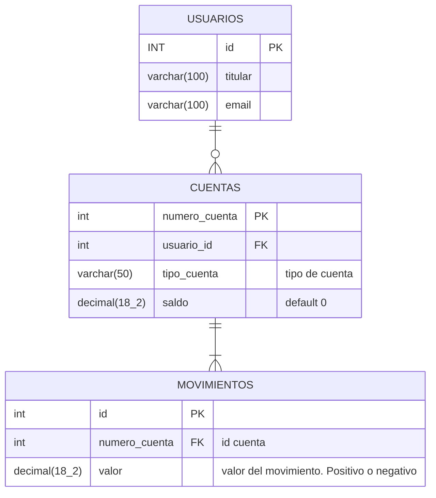

# Prueba Técnica Bancolombia

## Objetivos

- Crea una base de datos con una tabla llamada "Movimientos". La tabla debe tener campos para almacenar información como
  el valor de la transacción, número de cuenta, fecha.
- Cree una tabla llamada “Cuentas” con la información de número de cuenta, tipo de cuenta,saldo y titular.
- Ingrese información Dummy en ambas tablas
- Implementar una funcionalidad que permita a los usuarios generar un archivo de Excel que contenga el resumen de todos
  los movimientos de su cuenta, con un diseño amigable para el usuario tipo extracto con los logos de la organización.
- El Archivo Excel(o pdf) generado debe estar bloqueado para modificaciones.
- El Archivo Excel(o pdf) debe tener contraseña de apertura

### Tener en cuenta

- Considere la experiencia del usuario al desarrollar el formulario y las interacciones con la plataforma.
- Puede utilizar el lenguaje que considere más conveniente para las implementaciones.

### Entregables

- Script de creación de la base de datos
- Script de inserción de la data dummy
- Código fuente de la aplicación y documento pdf con explicación del procedimiento realizado para llegar a la solución

## Base de datos

### Entidades

### Scaffolding

Se puede realizar Scaffolding

```dotnetcli
dotnet ef dbcontext scaffold "Data Source=localhost; Initial Catalog=prueba_bancolombia; Trusted_Connection=True; TrustServerCertificate=true" Microsoft.EntityFrameworkCore.SqlServer --output-dir "Data/Models" --context-dir "Data"
```

O hacer referencia directa a la **ConnectionString** `Name=ConnectionString:connectionstring`

```dotnetcli
dotnet ef dbcontext scaffold "Name=ConnectionStrings:bancolombia" Microsoft.EntityFrameworkCore.SqlServer --output-dir "Data/Models" --context-dir "Data"
```